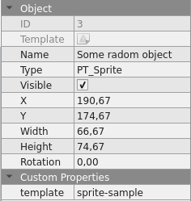

# Level template structure

All the levels are generated by Tiled. But some additional information are required in order to some subsystem works properly, those are described below:

## Tileset

- The tileset image need to be loaded by the Proto-Test using the *img-list.json*. 
- When adding a tileset to Tiled you need to mark the option: **Embed in map**.
- *margin* and *spacing* need to be zero, other values will not works as spectated.
  - later, it will works. 
  
## Object Layers

In order to add a new object to your level you need to create an Object Layer in Tiled.

### Using templates

The shape or object does not matter if you want to add some previous created template, it need to have at least the properties: 

- Type, x, y. 
- Custom properties: template
  - This is of type string and indicates the template to use. 

The position x, y from template will be ignored and will be used the x, y from Tiled. 

Example:

